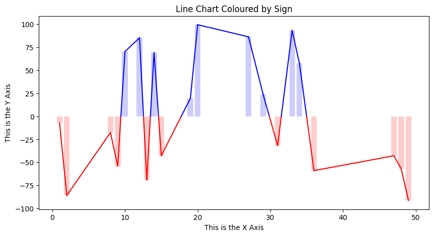

# dataviz-examples

A searchable database of code examples for common data visualizations in multiple coding languages.

I built this package because I like to quickly try different data visualizations without having to leave my IDE, and also because I don't like doing the same task more than once. 

```python
>>> example_finder = ExampleFinder()
>>> example_finder.print_all_example_names()
< prints out names of all available code examples >
>>> example_finder.search_by_tags("colour by sign")
2  Line Plot Coloured by Sign  [python]  {'matplotlib'}
>>> example_finder.print_example_metadata(2)
PLOT_NAME      Line Plot Coloured by Sign
PLOT_ALIASES   {'Line Plot Coloured by Threshold'}
DESCRIPTION    Line plot which changes colour based on which side of 0 the value falls on 
    (also includes transparent bar chart underneath)
TAGS           {'dynamic', 'sign', 'colour', 'line', 'threshold'}
FRAMEWORKS     {'matplotlib'}
LANGUAGE       python
>>> print( example_finder.get_example_code(2) )
< prints out code to generate this plot >
>>> exec( example_finder.get_example_code(2) )
```
